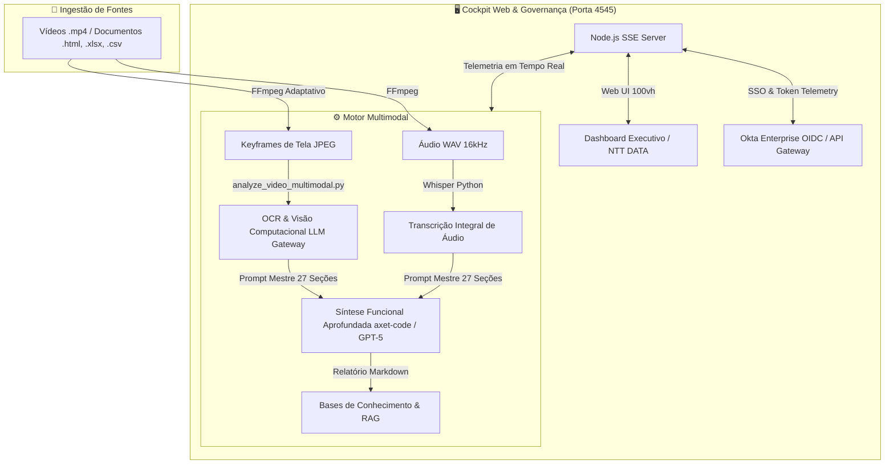
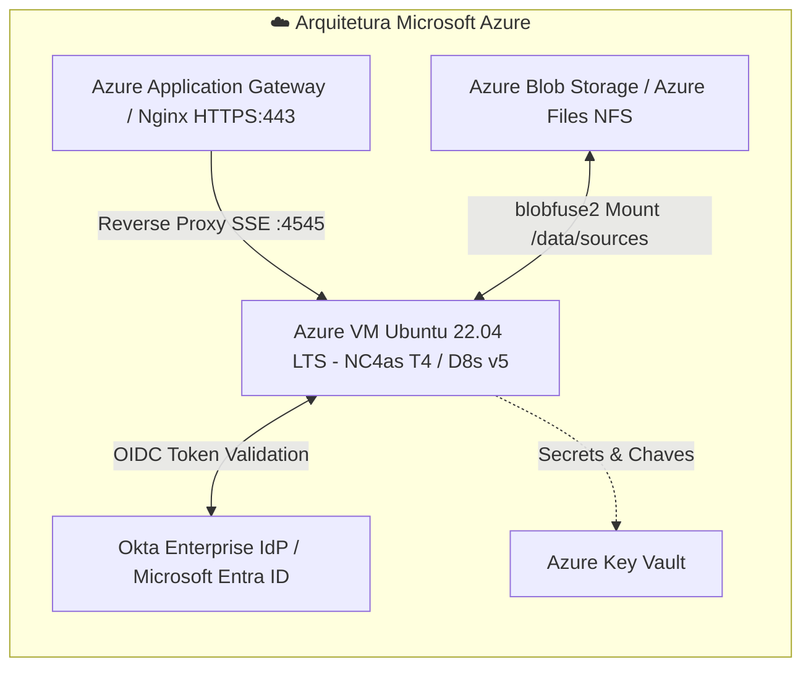

# 🧠 AXET-AGENT-CONTEXT-GEN

> **Pipeline Corporativo de Engenharia de Contexto, Transcrição Multimodal (Whisper + OCR de Telas), Síntese com IA e Cockpit Web RAG em Tempo Real.**

[](https://www.nttdata.com/)
[](https://nodejs.org/)
[](https://www.python.org/)
[](https://github.com/openai/whisper)
[](https://ffmpeg.org/)
[](https://www.okta.com/)
[](https://azure.microsoft.com/)

---

## 📌 Visão Geral

O **AXET-AGENT-CONTEXT-GEN** é um motor avançado de ingestão de vídeos e documentações técnicas (.mp4, .html, .xlsx, .csv, .txt, .pdf) desenhado para alimentar bases de conhecimento e sistemas de **Retrieval-Augmented Generation (RAG)** corporativos.

Diferente de pipelines de transcrição tradicionais que capturam apenas a fala, este sistema executa **análise multimodal em duas etapas**:
1. **Áudio:** Extração e transcrição profunda via modelo **Whisper** (com detecção de idioma e suporte a glossários técnicos).
2. **Visão / OCR:** Amostragem temporal inteligente e extração de keyframes compactados via **FFmpeg**, seguida de OCR detalhado via **LLM Gateway (Claude Sonnet / GPT-4o / GPT-5)** para captura de tabelas, formulários, fluxos de arquitetura e notas de tela.
3. **Síntese Mestre:** Redação técnica de relatórios com até 27 seções numeradas sem truncamento, mapa cronológico integrado (fala + telas) e blocos aprofundados de Q&A.
4. **Cockpit Web Corporativo:** Painel de controle em tempo real (Single-Screen 100vh) com telemetria contínua por Server-Sent Events (SSE), controle de taxa de transferência, gestão cumulativa de tokens e autenticação integrada via **Okta Enterprise OIDC**.

---

## 🏗️ Arquitetura do Sistema



---

## ⚙️ Pré-requisitos Gerais

* **FFmpeg & FFprobe:** 4.4 ou superior (com suporte a decodificação H.264/AAC).
* **Python:** 3.10 ou 3.11.
* **Node.js:** v18.x ou v20.x LTS (o dashboard utiliza arquitetura nativa com zero dependências externas no runtime Node).
* **Git:** Para clonagem e versionamento.
* **LLM Gateway / API Key:** Acesso a um provedor compatível (OpenAI, Claude via Gateway local em `:8766` ou serviço corporativo).

---

## 🚀 Instalação e Execução Local Rápida

### 🪟 No Windows (Instalador One-Click via WSL2)

O Windows 10/11 roda o pipeline com aceleração total de hardware via WSL2 sem exigir comandos manuais de Linux:

1. Clone o repositório ou baixe o ZIP:
   ```cmd
   git clone https://github.com/gcostabe/AXET-AGENT-CONTEXT-GEN.git
   cd AXET-AGENT-CONTEXT-GEN
   ```
2. Dê **duplo clique** no arquivo **`instalar_windows.bat`**.
   * Ele detecta e habilita o WSL2 automaticamente;
   * Instala FFmpeg, Python, Whisper e Node.js 20 em segundo plano;
   * Cria um atalho **`Iniciar Cockpit NTT DATA.bat`** na sua Área de Trabalho (Desktop).
3. **Uso diário:** Dê duplo clique no atalho da Área de Trabalho. Ele inicia o pipeline e abre o navegador automaticamente em `http://localhost:4545/`.

---

### 🍏 No macOS (Instalador One-Click)

1. Clone o repositório:
   ```bash
   git clone https://github.com/gcostabe/AXET-AGENT-CONTEXT-GEN.git
   cd AXET-AGENT-CONTEXT-GEN
   ```
2. Execute o script de configuração inicial:
   ```bash
   ./setup_mac.sh
   ```
   * Valida FFmpeg, Python e Node.js via Homebrew;
   * Configura o ambiente virtual `.venv` com Whisper;
   * Cria o atalho clicável **`Iniciar Cockpit NTT DATA.command`** na sua Mesa (Desktop).
3. **Uso diário:** Dê duplo clique no atalho da Mesa ou execute `./iniciar_mac.command`.

---

### 💻 Instalação Manual via Linha de Comando (Linux / Devs)

```bash
# 1. Configurar o ambiente virtual Python
python3 -m venv .venv
source .venv/bin/activate
pip install --upgrade pip
pip install openai-whisper torch torchvision

# 2. Inicializar o Cockpit Web
node dashboard/server.js 4545

# 3. Acessar no navegador
# Abra http://localhost:4545/
```

---

# ☁️ Guia Completo: Instalação e Deploy no Microsoft Azure

Para ambientes de produção corporativos, recomendamos a implantação em uma **Máquina Virtual Azure otimizada para Compute ou GPU**, conectada ao **Azure Blob Storage** para ingestão e armazenamento ilimitado de arquivos.



---

### Passo 1: Provisionamento da Máquina Virtual no Azure

Recomendamos escolher o SKU conforme a necessidade de velocidade do Whisper:
* **Com Aceleração por GPU (Whisper 10x mais rápido):** `Standard_NC4as_T4_v3` (4 vCPUs, 28 GiB RAM, GPU NVIDIA Tesla T4 16GB).
* **Otimizada para CPU (Custo balanceado):** `Standard_D8s_v5` ou `Standard_E8s_v5` (8 vCPUs, 32 GiB RAM).

#### Criando via Azure CLI:

```bash
# 1. Definir variáveis de ambiente
RG="rg-axet-context-gen-prod"
LOCATION="eastus2"
VM_NAME="vm-axet-pipeline-prod"
VNET_NAME="vnet-axet-prod"
SUBNET_NAME="snet-axet-compute"

# 2. Criar Resource Group
az group create --name $RG --location $LOCATION

# 3. Criar Rede Virtual (VNet) e Subnet
az network vnet create \
  --resource-group $RG \
  --name $VNET_NAME \
  --address-prefix 10.0.0.0/16 \
  --subnet-name $SUBNET_NAME \
  --subnet-prefix 10.0.1.0/24

# 4. Criar a Máquina Virtual com Ubuntu 22.04 LTS e Disco OS Premium SSD
az vm create \
  --resource-group $RG \
  --name $VM_NAME \
  --image Canonical:0001-com-ubuntu-server-jammy:22_04-lts-gen2:latest \
  --size Standard_NC4as_T4_v3 \
  --admin-username azureuser \
  --generate-ssh-keys \
  --os-disk-size-gb 128 \
  --storage-sku Premium_LRS \
  --vnet-name $VNET_NAME \
  --subnet $SUBNET_NAME
```

---

### Passo 2: Configurar o Network Security Group (NSG)

Liberar as portas necessárias para administração e acesso seguro:

```bash
# Liberar porta SSH (22) — Recomenda-se restringir ao seu IP corporativo
az network nsg rule create \
  --resource-group $RG \
  --nsg-name "${VM_NAME}NSG" \
  --name "Allow-SSH" \
  --priority 1000 \
  --access Allow \
  --protocol Tcp \
  --direction Inbound \
  --source-address-prefixes "SEU_IP_CORPORATIVO/32" \
  --destination-port-ranges 22

# Liberar porta HTTPS (443) para o Cockpit Web
az network nsg rule create \
  --resource-group $RG \
  --nsg-name "${VM_NAME}NSG" \
  --name "Allow-HTTPS" \
  --priority 1010 \
  --access Allow \
  --protocol Tcp \
  --direction Inbound \
  --source-address-prefixes "*" \
  --destination-port-ranges 443
```

---

### Passo 3: Preparação da Máquina Virtual (Dependências e CUDA)

Conecte-se à VM via SSH:
```bash
ssh azureuser@<IP_PUBLICO_DA_VM>
```

Execute a atualização do sistema e instale as dependências essenciais:

```bash
sudo apt update && sudo apt upgrade -y

# 1. Instalar utilitários básicos e compiladores
sudo apt install -y build-essential curl wget git jq software-properties-common

# 2. Instalar FFmpeg e FFprobe
sudo apt install -y ffmpeg

# 3. Instalar Node.js 20 LTS
curl -fsSL https://deb.nodesource.com/setup_20.x | sudo -E bash -
sudo apt install -y nodejs

# 4. Instalar Python 3.10/3.11 e ferramentas de venv
sudo apt install -y python3-pip python3-venv python3-dev

# 5. Se estiver usando VM com GPU NVIDIA (NC-series), instalar drivers e CUDA:
sudo apt install -y ubuntu-drivers-common
sudo ubuntu-drivers autoinstall
# Reiniciar se necessário: sudo reboot
```

---

### Passo 4: Montagem do Armazenamento de Vídeos (Azure Blob via blobfuse2)

Em ambientes de nuvem corporativos, os vídeos pesados devem residir no **Azure Blob Storage** ou **Azure Files**, evitando lotar o disco rígido da máquina virtual.

```bash
# 1. Instalar o blobfuse2
wget https://packages.microsoft.com/config/ubuntu/22.04/packages-microsoft-prod.deb
sudo dpkg -i packages-microsoft-prod.deb
sudo apt update
sudo apt install -y blobfuse2

# 2. Criar diretório de montagem e cache
sudo mkdir -p /mnt/azureblob/cache /data/sources /data/output
sudo chown -R azureuser:azureuser /data /mnt/azureblob

# 3. Criar arquivo de configuração /etc/blobfuse2-config.yaml
sudo bash -c 'cat <<EOF > /etc/blobfuse2-config.yaml
version: 2
logging:
  type: syslog
  level: log_warning
components:
  - libfuse
  - file_cache
  - attr_cache
  - azstorage
libfuse:
  attribute-expiration-sec: 120
file_cache:
  path: /mnt/azureblob/cache
  timeout-sec: 120
  max-size-mb: 20480
azstorage:
  type: block
  account-name: <SEU_STORAGE_ACCOUNT_NAME>
  container: videos-repositorio
  mode: key
  account-key: <SUA_STORAGE_ACCOUNT_KEY>
EOF'

# 4. Montar o container Blob no diretório local
blobfuse2 mount /data/sources --config-file=/etc/blobfuse2-config.yaml
```

---

### Passo 5: Clonagem e Configuração do Pipeline

```bash
cd /home/azureuser

# 1. Clonar o projeto
git clone https://github.com/gcostabe/AXET-AGENT-CONTEXT-GEN.git
cd AXET-AGENT-CONTEXT-GEN

# 2. Configurar o virtualenv Python com suporte a GPU
python3 -m venv .venv
source .venv/bin/activate
pip install --upgrade pip

# Se estiver em máquina com GPU NVIDIA CUDA:
pip install torch torchvision --index-url https://download.pytorch.org/whl/cu118
# Se estiver apenas em CPU:
# pip install torch torchvision --index-url https://download.pytorch.org/whl/cpu

# Instalar o Whisper
pip install openai-whisper

# 3. Configurar permissões de execução dos scripts
chmod +x scripts/*.sh scripts/*.py
```

---

### Passo 6: Criação do Serviço Systemd (Auto-Restart e Boot)

Para garantir que o Cockpit Web e o orquestrador iniciem automaticamente em caso de reinicialização da máquina e fiquem sempre online:

Crie o arquivo de serviço `/etc/systemd/system/axet-cockpit.service`:

```bash
sudo bash -c 'cat <<EOF > /etc/systemd/system/axet-cockpit.service
[Unit]
Description=AXET Agent Context Gen Cockpit Service
After=network.target

[Service]
Type=simple
User=azureuser
WorkingDirectory=/home/azureuser/AXET-AGENT-CONTEXT-GEN
Environment="PORT=4545"
Environment="NODE_ENV=production"
Environment="PATH=/home/azureuser/AXET-AGENT-CONTEXT-GEN/.venv/bin:/usr/local/bin:/usr/bin:/bin"
ExecStart=/usr/bin/node /home/azureuser/AXET-AGENT-CONTEXT-GEN/dashboard/server.js 4545
Restart=always
RestartSec=5
LimitNOFILE=65536

[Install]
WantedBy=multi-user.target
EOF'
```

Ative e inicie o serviço:
```bash
sudo systemctl daemon-reload
sudo systemctl enable axet-cockpit
sudo systemctl start axet-cockpit

# Verificar o status em tempo real
sudo systemctl status axet-cockpit
```

---

### Passo 7: Configuração de Reverse Proxy com Nginx e SSL (HTTPS)

Para expor o Cockpit de forma segura com criptografia TLS/HTTPS e suporte nativo ao streaming de telemetria via **Server-Sent Events (SSE)**:

```bash
# 1. Instalar Nginx e Certbot
sudo apt install -y nginx certbot python3-certbot-nginx

# 2. Configurar o bloco de servidor Nginx
sudo bash -c 'cat <<EOF > /etc/nginx/sites-available/axet-cockpit
server {
    listen 80;
    server_name cockpit.seudominio.com.br;

    location / {
        proxy_pass http://127.0.0.1:4545;
        proxy_http_version 1.1;
        
        # Suporte essencial a SSE (Server-Sent Events) sem buffering
        proxy_set_header Connection "";
        proxy_set_header Host \$host;
        proxy_set_header X-Real-IP \$remote_addr;
        proxy_set_header X-Forwarded-For \$proxy_add_x_forwarded_for;
        proxy_set_header X-Forwarded-Proto \$scheme;
        
        proxy_buffering off;
        proxy_cache off;
        proxy_read_timeout 86400s;
        proxy_send_timeout 86400s;
    }
}
EOF'

# 3. Ativar o site e testar configuração
sudo ln -s /etc/nginx/sites-available/axet-cockpit /etc/nginx/sites-enabled/
sudo rm -f /etc/nginx/sites-enabled/default
sudo nginx -t
sudo systemctl restart nginx

# 4. Gerar Certificado SSL Gratuito com Let's Encrypt
sudo certbot --nginx -d cockpit.seudominio.com.br --non-interactive --agree-tos -m seu-email@nttdata.com
```

---

## 🔒 Integração de Autenticação Corporativa (Okta SSO / Entra ID)

O Cockpit está desenhado para reconhecer tokens corporativos OIDC emitidos por Provedores de Identidade da organização (ex.: **Okta Enterprise OIDC - OneNTT** ou **Microsoft Entra ID**).

1. O backend inspeciona dinamicamente os tokens JWT montados no ambiente ou sincronizados via API Gateway corporativo.
2. É validado o claim `email`, `sub`, `displayName` e o tempo de expiração (`exp`), alimentando dinamicamente o status no card de usuário e no cabeçalho.
3. Para configurar variáveis de ambiente adicionais para SSO no Azure:
   ```bash
   export OKTA_TENANT="onentt"
   export OKTA_REGION="emeal-onentt"
   export API_GATEWAY_URL="http://localhost:3001"
   ```

---

## 📊 Estrutura de Diretórios em Produção

```text
/home/azureuser/AXET-AGENT-CONTEXT-GEN/
├── dashboard/               # Interface Web e Servidor HTTP/SSE nativo
│   ├── server.js            # Servidor Node.js (API REST + SSE + Watchdog)
│   ├── app.js               # Frontend dinâmico com paginação e status SSE
│   ├── index.html           # Layout Single-Screen 100vh corporativo
│   └── style.css            # Design System NTT DATA
├── scripts/                 # Motores de processamento e extração
│   ├── process_video.sh     # Script orquestrador principal Bash
│   ├── analyze_video_multimodal.py  # Análise visual e OCR via LLM Gateway
│   └── extract_video_frames.py      # Extrator de keyframes de tela FFmpeg
├── prompts/                 # Prompts de engenharia sênior de IA
│   └── analise_video_multimodal.md  # Template mestre de 27 seções numeradas
├── logos/                   # Identidade visual institucional NTT DATA
├── .agent/                  # Persistência de estado e memória atômica
│   ├── batch_manifest.json  # Manifesto atômico de progresso e lote
│   ├── state.md             # Estado operacional atual
│   └── execution_journal.md # Auditoria de checkpoints
└── output/                  # Destino dos relatórios .md gerados
```

---

## 🛡️ Salvaguardas Operacionais & Governança

* **Zero Poluição em Nuvem:** Todos os frames de vídeo temporários gerados pelo FFmpeg são alocados em diretórios efêmeros (`/tmp/axet-workspace/`) e eliminados imediatamente após a síntese da IA, impedindo crescimento descontrolado de disco.
* **Detecção Dual de Arquivos Concluídos:** O sistema valida o tamanho (> 150 bytes) e conteúdo do relatório Markdown gerado antes de iniciar uma nova transcrição, evitando processamento redundante e economizando custos com GPUs e tokens de LLM.
* **Auto-Healing Watchdog:** O servidor mantém um processo supervisor contínuo que monitora a fila de execuções ativas e recupera workers em caso de reinicialização ou interrupção de rede.

---

## 📄 Licença e Uso Corporativo

Desenvolvido para operações de **Engenharia de Contexto e Arquitetura RAG** da **NTT DATA EMEAL**. Todos os direitos reservados.
